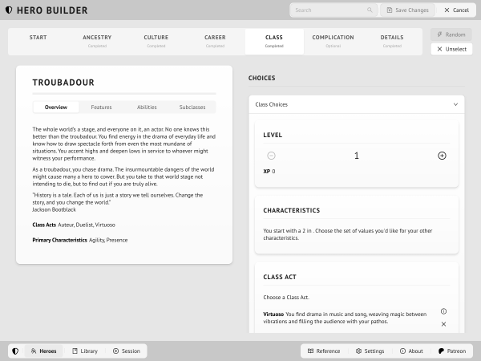
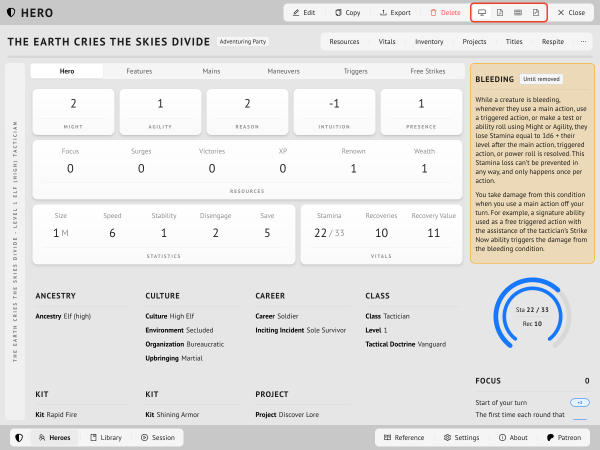
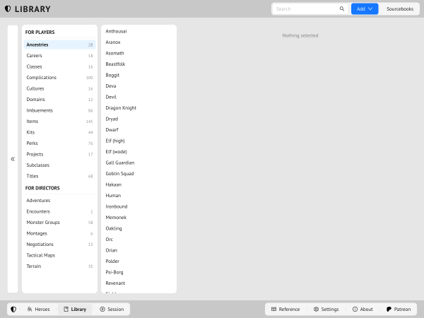
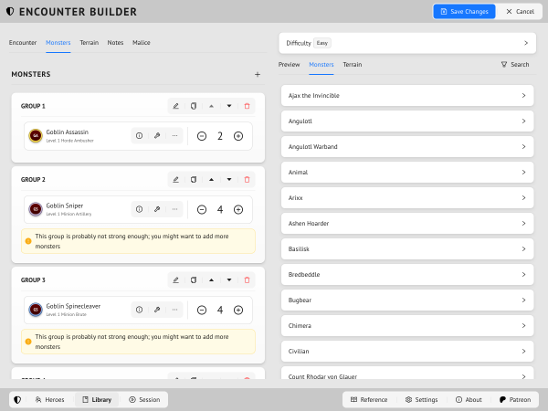
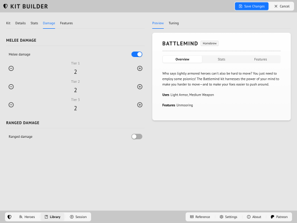
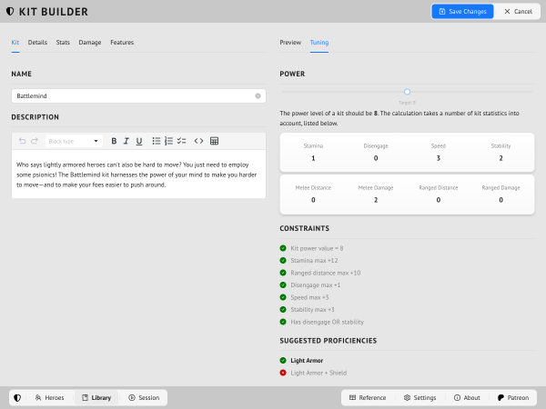
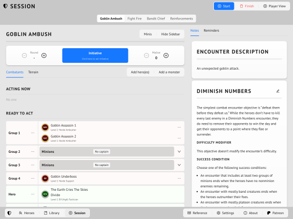
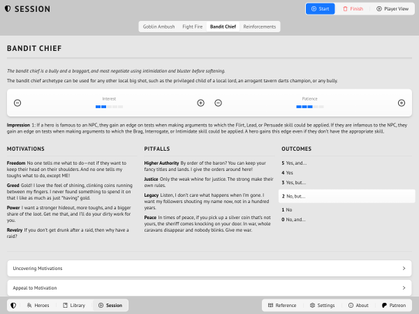

# Forge Steel

**FORGE STEEL** is a hero builder and Director's toolkit for the **DRAW STEEL** tabletop RPG, designed and built by [Andy Aiken](mailto:andy.aiken@live.co.uk).

[](https://github.com/andyaiken/forgesteel/actions/workflows/digitalocean.yml)
[](license.md)
[](https://forgesteel.net)

**➜ [Try it now at forgesteel.net](https://forgesteel.net)**

## Contents

- [Heroes](#heroes)
- [Library](#library)
- [Homebrew](#homebrew)
- [Session](#session)
- [Legal](#legal)
- [Development](#development)

## Heroes

Build a hero step-by-step, start from a pregen, or let Forge Steel generate one at random. Heroes can be organized into folders once your collection grows.

<p>
  
  
</p>

Each hero gets an interactive character sheet for use at the table, or a classic view if you'd rather print it out. From the sheet you can make ability rolls, manage stamina and conditions, track inventory and downtime projects, customize your hero with almost anything in the game, and manage a retinue of mounts, retainers, or summoned monsters.

## Library

The Library holds every piece of official content in the game - ancestries, classes, kits, and more - organized by sourcebook, including third-party content from the Blacksmith's Guild, Ratcatcher magazine, Triglav Games, and the Draw Steel homebrew community.

<p>
  
  
</p>

It's also where you design the building blocks of a session - encounters, negotiations, montages, adventures, and tactical maps. Forge Steel can generate a balanced encounter or a random tactical map for you in a hurry, and every element can be switched to a classic, printable view.

## Homebrew

You can create your own homebrew elements from scratch or by copying an official one. Forge Steel helps as you go: it shows comparable monsters while you build a new one, checks that a homebrew kit isn't overpowered, and offers a Genesplice tool that mashes existing creatures together to spark new ones.

<p>
  
  
</p>

## Session

When it's time to play, the Session screen runs what you built in the Library. Track stamina and conditions for every combatant in an encounter, successes and failures in a montage, and interest and patience in a negotiation - and set up counters for anything else your adventure needs to track. You can run several encounters, montages, or negotiations at once and switch between them freely.

<p>
  
  
</p>

## Legal

**FORGE STEEL** is an independent product published under the DRAW STEEL Creator License and is not affiliated with MCDM Productions, LLC.

**DRAW STEEL** © 2024 MCDM Productions, LLC.

Forge Steel is released under the [GNU General Public License v3.0](license.md).

## Development

**FORGE STEEL** is written in TypeScript, using React and Ant Design.

If you would like to contribute, you can:

* Add feature requests and raise bug reports [here](https://github.com/andyaiken/forgesteel/issues)
* Fork the repository, make your changes to the code, and raise a pull request

### Getting started

Requires [Node.js](https://nodejs.org/) 24 or later.

```bash
npm install
npm run start
```

Once running, the app is available at `http://localhost:5173/`.

### Before submitting a pull request

Make sure the linter, type checker, and unit tests all pass:

```bash
npm run check
```
