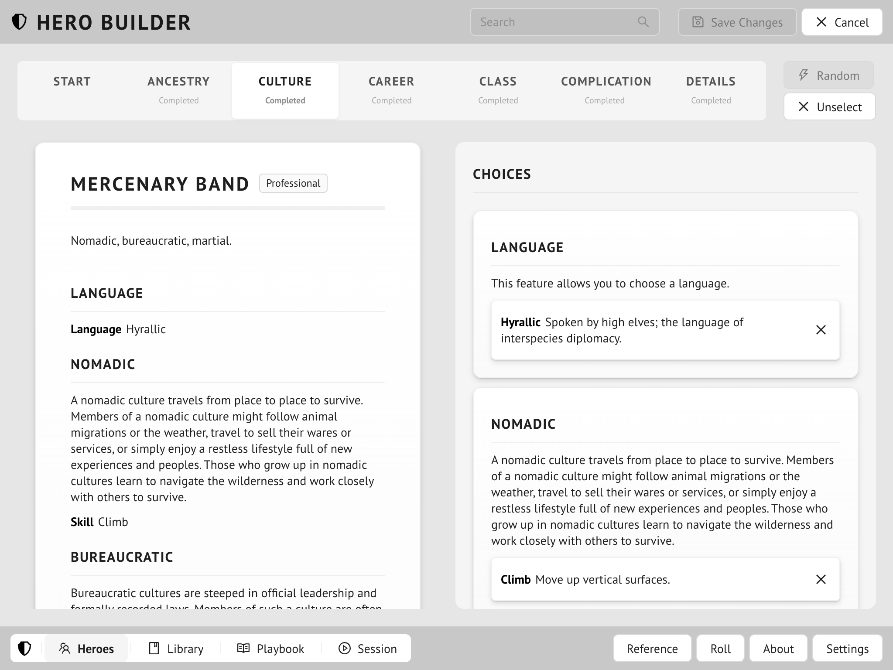
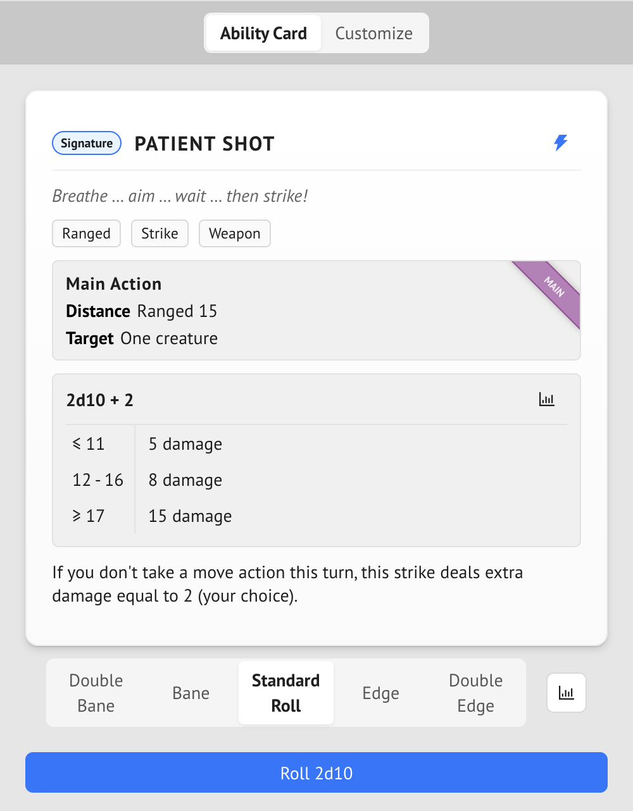
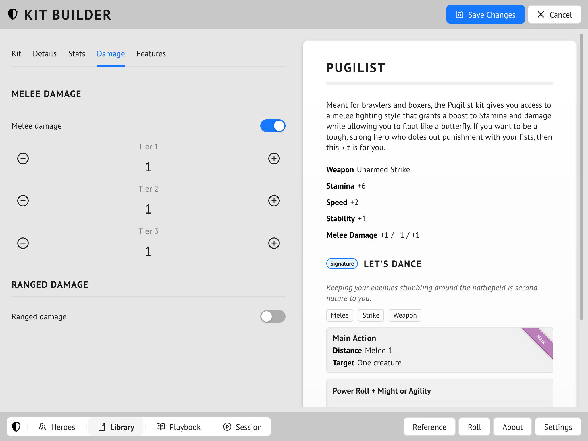

# Forge Steel

**FORGE STEEL** is a hero builder app for **DRAW STEEL**, designed by [Andy Aiken](mailto:andy.aiken@live.co.uk).

You can find it [here](https://andyaiken.github.io/forgesteel/).

## Heroes

With this app you can create heroes using the **DRAW STEEL** backer packet.


Here is a hero being edited.


This shows a hero's character sheet.


Here we can see the hero being played in a session.


The player is making the power roll for one of the hero's abilities.

## Homebrew

You can also use this app to create homebrew hero-building elements - ancestries, classes, kits, and so on.


Here we can see the list of elements that can be homebrewed. To create a homebrew element you can create it from whole cloth, or copy an official element.


here we can see a homebrew kit being created.

## Legal

**FORGE STEEL** is an independent product published under the DRAW STEEL Creator License and is not affiliated with MCDM Productions, LLC.

**DRAW STEEL** © 2024 MCDM Productions, LLC.

## Development

**FORGE STEEL** is written in Typescript, using React and Ant Design.

If you would like to contribute, you can:

* Add feature requests and raise bug reports [here](https://github.com/andyaiken/forgesteel/issues)
* Fork the repository, make your changes to the code, and raise a pull request

To run the app locally, run the following commands:

```
npm install
npm run start
```

Once built, the app should then be available at `http://localhost:5173/forgesteel/`.

When you've finished with your changes, make sure to appease the linter:

```
npm run lint
```
